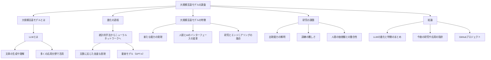

# A Survey of Large Language Models
- <https://arxiv.org/abs/2303.18223v10>
- <https://arxiv.org/pdf/2303.18223v10>
- <https://ar5iv.labs.arxiv.org/html/2303.18223>

---
## 序論
本論文は、大規模言語モデル（LLM）の発展とその現状を包括的に調査し、研究者がLLMの理解と利用を深めるための基礎を提供することを目的としています。

## 大規模言語モデルとは
LLMとは、膨大なデータを学習することで、文章の生成や理解を可能にする人工知能モデルです。これらのモデルは、言語処理の精度を飛躍的に向上させ、多くの応用分野で活用されています。

## 進化の過程
初期の言語モデルは統計的手法に基づいていましたが、現在のLLMはニューラルネットワークを用いており、文脈に応じた高度な表現を学習します。特にGPT-4などの最新モデルは、一般的なタスク解決能力を持つとされています。

## 大規模言語モデルの特徴
LLMは、以下の三つの主要な特徴を持っています：
1. **新たな能力の発現**：従来の小規模なモデルでは見られなかった高度なタスク処理能力。
2. **人間とAIのインターフェースの変革**：プロンプトを通じた操作方法の普及。
3. **研究とエンジニアリングの融合**：大規模なデータ処理と分散トレーニングが必要。

## 研究の課題
LLMの研究には以下の課題があります：
1. **出現能力の解明**：LLMがなぜ新たな能力を持つのかの理解が不足。
2. **訓練の難しさ**：高い計算リソースが必要であり、繰り返しの実験が困難。
3. **人間の価値観との整合性**：有害な内容を生成するリスクの管理。

## 結論
本論文は、LLMの進化とその特徴を体系的にまとめ、今後の研究や応用における指針を示しています。詳細な分析やリソースは、[GitHubプロジェクト](https://github.com/RUCAIBox/LLMSurvey)で提供されています。

---
## AI generated diagram

