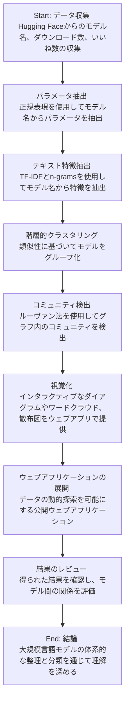

# On the Origin of LLMs: An Evolutionary Tree and Graph for 15,821 Large Language Models
- <https://arxiv.org/abs/2307.09793>
- <https://arxiv.org/pdf/2307.09793>

---
## LLMの起源：15,821の大規模言語モデルの進化的ツリーとグラフ
## 序論
本論文は、大規模言語モデル（LLM）の進化的な関係を明らかにすることを目的としています。特に、2022年以降のLLMの急速な発展とその多様性を体系的に理解するための研究です。

## 研究の背景
LLMは、特にChatGPTやBardのように、多くのユーザーに利用されています。毎週多くの新しいLLMが発表され、Hugging Faceに登録されていますが、それらの総合的なインデックスは存在しません。

## 方法
Hugging Faceに登録されているLLMの名称を用いて、階層的クラスタリングを実施しました。n-gramsやTF-IDF（Term Frequency-Inverse Document Frequency）を用いて、LLMのコミュニティを特定し、意味のあるサブグループに分類しました。

## 結果
本研究では、LLMのファミリーを特定し、それらを意味のあるサブグループに分類することに成功しました。また、15,821のLLMを視覚的に探索できるウェブアプリケーション「Constellation」を公開しました。

## 結論
「Constellation」を利用することで、研究者や開発者はLLMの関係性やトレンドを迅速に把握することが可能となりました。これは、LLMのさらなる発展や新しい研究の基盤となるでしょう。

## 補足情報
詳細な分析結果や視覚化ツールについては、[こちら](https://constellation.sites.stanford.edu)で確認できます。

---
## AI generated diagram

