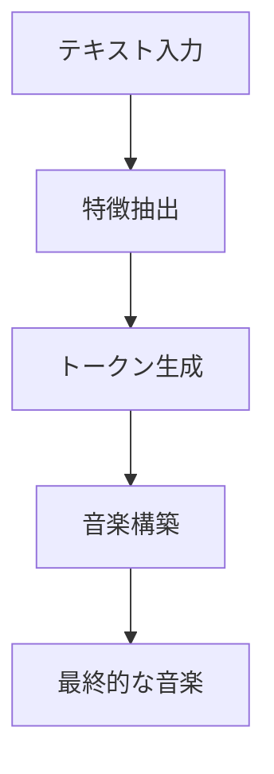

# Simple and Controllable Music Generation
- <https://arxiv.org/abs/2306.05284>
- <https://arxiv.org/pdf/2306.05284>
- <https://qiita.com/xiao_ming/items/75b7144ff1ec5fd6c46e>

---

## MusicGen：効率的な音楽生成モデルの詳細解説

## 1. 研究背景と課題

### 1.1 音楽生成の技術的課題
- 長時間シーケンスのモデリングが必要
- 音楽は音声より高いサンプリングレートが必要（44.1kHz/48kHz vs 16kHz）
- 複数の楽器による複雑な構造の処理
- 人間は不協和音に敏感で、メロディの誤りに対する許容度が低い

### 1.2 既存研究の限界
- 複数のモデルを階層的に組み合わせる必要があった
- アップサンプリングによる品質低下
- 制御が難しい
- 計算コストが高い

## 2. MusicGenの技術アーキテクチャ

### 2.1 基本構造の詳細
- 単一の言語モデルによる設計
- EnCodecによる音声の離散トークン化
- 効率的なトークン配置パターン
- Transformerベースの自己回帰モデル

### 2.2 コードブックパターンの詳細実装


#### Flattening Pattern
- すべてのコードブックを直列化
- 理論的に完全な自己回帰分解が可能
- 計算コストは高いが品質は最高

#### Delay Pattern
- コードブック間に遅延を導入
- 並列処理と品質のバランスを取る
- 実用的な性能と効率性を実現

#### Parallel Pattern
- すべてのコードブックを並列処理
- 最も計算効率が良い
- 品質は若干低下

#### Coarse First Pattern
- 粗いコードブックを優先的に処理
- 2段階の生成プロセス
- 品質と効率性のバランスを取る

### 2.3 モデルアーキテクチャの詳細
- レイヤー正規化の使用
- 残差接続の実装
- クロスアテンション機構
- ポジショナルエンコーディング

## 3. 条件付け手法の詳細実装

### 3.1 テキストによる条件付け
#### T5エンコーダー
- 事前学習済みモデルの活用
- テキスト表現の効率的な抽出
- 汎用的な言語理解能力

#### FLAN-T5
- インストラクションベースの言語モデル
- より高度なテキスト理解
- タスク特化型の処理

#### CLAP
- テキストと音声の結合表現学習
- マルチモーダルな理解能力
- より自然な音楽生成

### 3.2 メロディーによる条件付け
#### クロマグラム処理
- 音楽の調性情報の抽出
- 時間周波数表現の利用
- 情報のボトルネック導入による過学習防止

#### 教師なし学習アプローチ
- 教師データ不要
- スケーラブルな学習
- 柔軟な適用可能性

## 4. 実験結果の詳細分析

### 4.1 評価指標
- FAD (Fréchet Audio Distance)
- KL divergence
- CLAP score
- 人間による主観評価（品質・関連性）

### 4.2 比較実験結果
#### 定量的評価
- FADスコア：3.1-3.8（モデルサイズによる）
- KL divergence：1.22-1.28
- CLAPスコア：0.31-0.32

#### 主観評価結果
- 全体的品質：84.81/100
- テキスト関連性：82.47/100
- 競合モデルを上回る評価

### 4.3 ステレオ音声生成の実装


#### Stereo Delay Pattern
- 左右チャンネルの独立処理
- チャンネル間の遅延導入
- 空間的な表現の実現

#### Stereo Partial Delay Pattern
- 部分的な遅延の導入
- 効率的な処理
- 品質維持の工夫

## 5. 技術的貢献の詳細

### 5.1 モデルの簡素化
- 単一ステージの設計
- 効率的なトークン配置
- 計算コストの削減

### 5.2 制御機能の実装
- テキストベースの制御
- メロディーベースの制御
- 柔軟な生成オプション

### 5.3 品質向上の工夫
- 効率的なサンプリング
- ノイズ制御
- 高解像度音声生成

## 6. 限界と今後の課題

### 6.1 現在の制限事項
- 細かな制御の難しさ
- データ拡張の必要性
- データセットの偏り

### 6.2 社会的な課題
- アーティストとの共存
- 著作権問題
- 倫理的考慮

### 6.3 将来の研究方向
- より細かな制御機能の開発
- データセットの多様化
- 計算効率の更なる向上
- ユーザーインターフェースの改善

## 7. 産業への影響と応用

### 7.1 音楽制作への応用
- プロフェッショナルツールとしての利用
- アマチュア向けの創作支援
- 音楽教育への活用

### 7.2 技術的影響
- 音声処理技術への影響
- AI生成モデルの発展
- 新しい表現手法の可能性

### 7.3 今後の展望
- より自然な音楽生成
- リアルタイム処理の実現
- インタラクティブな音楽生成

この研究は、AIによる音楽生成の分野に大きな進展をもたらし、特にモデルの単純化と品質向上の両立を実現した点で重要な意義を持ちます。今後のAI音楽生成技術の基礎となる可能性が高い研究といえます。

---

## MUSICGENの特徴と仕組みの詳細解説

## 1. 基本的な仕組み

### 音楽の分解と再構成
1. **音声のデジタル化**
   - 音楽を細かい数値データに変換
   - 1秒間に32,000回のサンプリング

2. **トークン化**
   - EnCodecという技術で音楽を「トークン」に分解
   - トークン = 音楽の特徴を表す小さな単位
   - 例：メロディ、リズム、音色などの情報を含む

3. **データの圧縮**
   - 大量の音声データを効率的に扱える形に変換
   - 重要な特徴を残しながら情報を圧縮

## 2. 主要な機能と実現方法

### A. テキストによる音楽生成
1. **テキスト処理の仕組み**
   - T5という言語モデルでテキストを解析
   - 音楽の特徴に関する情報を抽出
   - 例：「90年代のロック」→ tempo(速さ), genre(ジャンル), instruments(楽器)などの情報に変換

2. **生成プロセス**
   ```
   入力：「エレキギターが印象的な明るいロック」
   ↓
   テキスト解析
   - テンポ：中速〜速め
   - 主要楽器：エレキギター
   - 雰囲気：明るい
   - ジャンル：ロック
   ↓
   音楽生成
   - 指定された特徴に基づいて音楽を組み立て
   ```

### B. メロディによる制御
1. **クロマグラム技術**
   - メロディの特徴を数値化
   - 音の高さと時間の関係を表現
   - 例：ドレミファソラシドの音程情報を時間軸で記録

2. **メロディの反映方法**
   ```
   入力メロディ（ハミングなど）
   ↓
   クロマグラム分析
   - 音の高さの変化を検出
   - リズムパターンを認識
   ↓
   新しい音楽生成
   - 元のメロディの特徴を保持
   - 新しいアレンジやハーモニーを追加
   ```

### C. 高品質な音声生成

1. **トランスフォーマーモデル**
   - AIの中核となる技術
   - 音楽の長期的な構造を理解
   - 調和の取れた音楽を生成

2. **品質向上の工夫**
   ```
   生成プロセス
   ↓
   品質チェック
   - 不協和音の検出
   - リズムの一貫性確認
   ↓
   修正・調整
   - 問題箇所の修正
   - 全体のバランス調整
   ```

## 3. 独自の技術的特徴

### A. コードブックパターン
- 音楽データを効率的に扱う独自の方法
- 複数の情報を並列で処理
- 処理速度と品質のバランスを最適化

```
従来の方法：
データ → モデル1 → モデル2 → モデル3 → 音楽

MUSICGENの方法：
データ → 単一の高性能モデル → 音楽
```

### B. ステレオ音声対応
1. **左右チャンネルの処理**
   - 独立したチャンネル処理
   - 空間的な音の広がりを表現
   - 自然な立体音響を実現

2. **効率的な処理**
   ```
   モノラル音声の2倍の情報量
   ↓
   効率的な並列処理
   ↓
   計算コストを抑えながら高品質な立体音響を実現
   ```

## 4. 実用的な特徴

### A. 柔軟な制御
- テキストとメロディの組み合わせ可能
- 生成過程での微調整が可能
- ユーザーの意図を反映しやすい

### B. 高速な処理
- 一般的なコンピュータでも実行可能
- リアルタイムに近い応答
- 実用的な処理時間

### C. 安定した品質
- 一貫した音楽品質
- 自然な音楽構造
- 人間の耳に心地よい音楽生成

このように、MUSICGENは複雑な音楽生成の課題を、革新的な技術と効率的な処理方法で解決しています。シンプルな構造でありながら、高品質な音楽生成を実現している点が大きな特徴です。

---
## MUSICGENの音楽生成プロセスの詳細

## 1. 音楽生成の全体的な流れ



## 2. 各ステップの詳細

### Step 1: テキストから音楽的特徴への変換
```
入力例：「エレキギターが印象的な明るいロック」

↓ T5エンコーダーによる解析

抽出される情報：
- ジャンル: ロック
- 主要楽器: エレキギター
- テンポ: 中速〜速め
- 雰囲気: 明るい
```

### Step 2: トークン生成プロセス

トランスフォーマーモデルが以下の要素を順番に生成：

1. **基本構造の生成**
   - テンポと拍子の設定
   - 曲の基本的な長さの決定
   - 主要なコード進行の決定

2. **メロディラインの生成**
   - 主要なメロディの作成
   - フレーズの構築
   - 音の高さとリズムの決定

3. **ハーモニーの構築**
   - コード進行の詳細化
   - 和音の重なりの決定
   - 調性の維持

4. **楽器パートの生成**
   - 各楽器のパートを作成
   - 音色の特徴を反映
   - パートごとのバランス調整

### Step 3: 音楽データの構築方法

```
時間軸 →
|-------|-------|-------|-------|
   ↑       ↑       ↑       ↑
   1小節    2小節    3小節    4小節

各小節内で：
- メロディトークン
- リズムトークン
- ハーモニートークン
- 音色トークン
を組み合わせて音楽を構築
```

### Step 4: 自己回帰的な生成プロセス

1. **シーケンシャルな生成**
   ```
   前の音 → 次の音 → さらに次の音
   （前の音を考慮しながら次の音を決定）
   ```

2. **パターンの認識と適用**
   - 繰り返しパターンの検出
   - 音楽的な規則性の維持
   - 自然な展開の生成

3. **一貫性の確保**
   - 調性の維持
   - リズムの一貫性
   - メロディの自然な流れ

### Step 5: 品質向上のための処理

1. **音楽理論に基づくチェック**
   - 不協和音の検出と修正
   - リズムパターンの確認
   - メロディの自然さの確認

2. **全体的なバランス調整**
   - 音量バランスの調整
   - 周波数特性の最適化
   - ステレオ感の調整

## 3. 技術的な特徴

### トークン処理の特徴
```
音楽データの表現：
1. コードブック1: 基本的な音楽情報
2. コードブック2: 詳細な音色情報
3. コードブック3: 音響的な特徴
4. コードブック4: 微細な変化
```

### 並列処理による効率化
```
従来の方法：
トークン1 → トークン2 → トークン3 → トークン4

MUSICGENの方法：
トークン1
トークン2  → 同時処理
トークン3
トークン4
```

## 4. 最終的な出力

1. **音楽データの統合**
   - 各トークンの情報を統合
   - 連続的な音声波形に変換
   - 32kHzのサンプリングレートで出力

2. **品質の最終確認**
   - 音楽的な一貫性の確認
   - 技術的な品質チェック
   - 指定された特徴との整合性確認

このように、MUSICGENは複雑な音楽生成プロセスを、効率的かつ高品質に実行しています。特に、トークンベースのアプローチと並列処理の組み合わせにより、従来のモデルより高速で高品質な音楽生成を実現しています。
