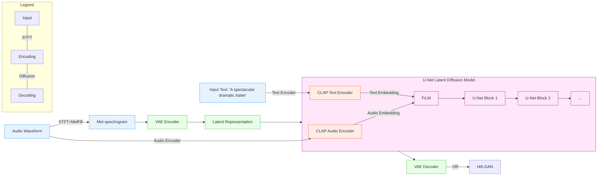
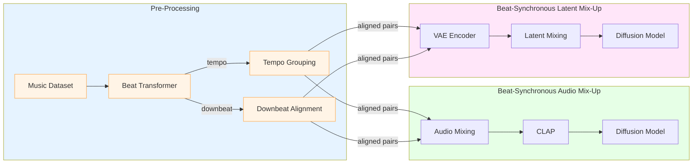

# MusicLDM: Enhancing Novelty in Text-to-Music Generation Using Beat-Synchronous Mixup Strategies
- <https://arxiv.org/abs/2308.01546>
- <https://arxiv.org/pdf/2308.01546>

---

## MusicLDM: テキストから音楽生成を改善する研究

## 1. 研究の概要と背景

この研究は、テキストから音楽を生成する新しいAIモデル「MusicLDM」を提案しています。

### 1.1 主な課題

テキストから音楽を生成する際の2つの主要な課題があります：

1. 学習データの不足
- 画像生成と比べて、テキストと音楽のペアデータが少ない
- 音楽には旋律、ハーモニー、リズム、音色など複雑な要素がある

2. 著作権とコピー問題
- 生成された音楽が既存の曲に似すぎると著作権侵害の恐れ
- オリジナリティのある音楽生成が必要

### 1.2 提案手法

研究チームは以下の2つのアプローチで解決を図りました：

1. MusicLDMモデルの開発
- Stable DiffusionとAudioLDMのアーキテクチャを音楽生成用に最適化
- CLAPとHifi-GANを音楽データで再学習

2. 新しいデータ拡張手法の提案
- ビート同期オーディオミックスアップ(BAM)
- ビート同期潜在空間ミックスアップ(BLM)

## 2. MusicLDMの技術詳細

### 2.1 モデルのアーキテクチャ

MusicLDMは以下の3つの主要コンポーネントで構成されています：

1. CLAP (Contrastive Language-Audio Pretraining)
- テキストと音声の関係性を学習するモデル
- 音声エンコーダーとテキストエンコーダーを含む

2. VAE (Variational Auto-Encoder)
- 音声をより扱いやすい潜在表現に変換
- エンコーダーとデコーダーで構成

3. 潜在拡散モデル
- U-Net構造を持つ
- テキストの特徴を条件として音楽を生成

### 2.2 ビート同期ミックスアップ戦略

2つのミックスアップ戦略が提案されています：

1. ビート同期オーディオミックスアップ(BAM)
- 音声波形レベルでのミックス
- テンポとビートを合わせて混合
- 音楽的な一貫性を保持

2. ビート同期潜在空間ミックスアップ(BLM)
- VAEの潜在空間でのミックス
- より自然な音楽生成が可能
- 計算コストは高い

## 3. 実験と結果

### 3.1 実験設定

- データセット：Audiostock（9,000曲の訓練データ、1,000曲のテストデータ）
- サンプリングレート：16kHz
- 音声長：10.24秒

### 3.2 評価指標

1. 生成品質
- FD (Frechet Distance)
- IS (Inception Score)
- KL (Kullback-Leibler) ダイバージェンス

2. テキストとの関連性
- テキスト-音声類似度

3. 独創性
- 最近傍音声類似度比率

### 3.3 主な実験結果

1. 生成品質の比較：
- MusicLDMは既存モデルより優れた性能
- BLMが最も高い品質を達成

2. テキストとの関連性：
- オリジナルMusicLDMが最高スコア
- ミックスアップ戦略でもある程度の関連性を維持

3. 独創性評価：
- BLMが最も低い類似度比率を達成
- コピー問題の軽減に効果的

## 4. 制限事項と今後の課題

1. サンプリングレートの制限
- 現在は16kHzで生成
- 音楽制作標準の44.1kHzへの対応が必要

2. リソース制約
- より大規模なデータセットでの検証が必要
- GPU処理能力の制限

3. 音楽同期技術
- ビート以外の同期方法の探索
- 調性やインストゥルメントの整合性

## 5. 結論と展望

MusicLDMは以下の点で革新的な成果を示しました：

1. 技術的成果
- 高品質な音楽生成を実現
- データ効率の改善
- コピー問題の軽減

2. 実用的意義
- 音楽制作支援への応用
- 創造的表現の新しい可能性

3. 今後の発展
- より高品質な音楽生成
- 実用的なアプリケーション開発

研究チームは、特にBLM戦略の効果を強調し、テキストから音楽を生成する技術の新しい可能性を示しました。
