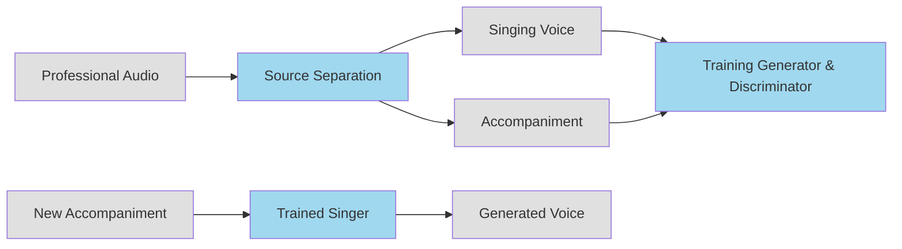

# Score and Lyrics-Free Singing Voice Generation
- <https://arxiv.org/abs/1912.11747>
- <https://arxiv.org/pdf/1912.11747>

---

## 歌詞とスコアを使わない歌声合成に関する研究解説

## 1. 研究の概要と目的

この研究は、従来の歌声合成(SVS: Singing Voice Synthesis)とは異なるアプローチを提案しています。

従来のSVSは:
- 楽譜(音符の配列)と歌詞が必要
- それらに基づいて歌声を生成

一方、この研究が目指すのは:
- 楽譜も歌詞も使わない歌声生成
- 訓練時にも推論時にも不要
- より自由な歌声表現の実現

この新しいアプローチが必要な理由:
1. 人間の歌唱活動は楽譜に頼らないものも多い
   - 子供の自発的な歌唱
   - ハミング
   - ジャズボーカリストの即興演奏
2. より自由な音楽表現の可能性を広げる

## 2. 提案される3つの歌声生成方式

### 2.1 フリーシンガー (Free Singer)
- ランダムノイズのみを入力として歌声を生成
- 入浴中のハミングのような自由な歌唱を目指す
- 必ずしも良い歌声である必要はない

### 2.2 アカンパニードシンガー (Accompanied Singer) 
- 伴奏音楽を入力として受け取る
- 伴奏に合わせて歌声を生成
- カラオケのように、ただし歌詞なしで
- 伴奏のメロディーを単に真似るのではなく、調和する新しいメロディーを生成

### 2.3 ソロシンガー (Solo Singer)
- フリーシンガーと同様にノイズを入力として受け取る
- しかし、まず「内部アイデア」を生成
- その「内部アイデア」に基づいて歌声を生成
- 例：コード進行を内部アイデアとして生成

## 3. 技術的な課題

研究では以下の3つの主要な課題が挙げられています：

1. 教師なし学習の必要性
   - 音素やピッチのラベルなし
   - 音声信号から直接学習する必要がある

2. データ収集の困難さ
   - ボーカル単独のトラックが必要
   - アカンパニードシンガーの場合は伴奏トラックも必要
   - 公開されているデータが少ない

3. 一対多の関係性
   - 特にアカンパニードシンガーの場合
   - 1つの伴奏に対して複数の妥当な歌唱パターンが存在
   - 特定の歌声のみを正解とすることはできない

## 4. 提案手法

### 4.1 基本アーキテクチャ
- GANベースのアーキテクチャを採用
- メルスペクトログラムの生成を学習
- 生成されたメルスペクトログラムはボコーダーで音声に変換

### 4.2 モデルの特徴
- GRU(Gated Recurrent Units)を使用
- Dilated Convolutionsを採用
- 可変長の波形生成が可能
- フレームごとのノイズを入力として使用

### 4.3 データ準備
- ソース分離モデルを実装
- プロの音楽録音から歌声と伴奏を分離
- 分離された音声トラックを訓練データとして使用

### 4.4 コード生成器
ソロシンガーのために以下の機能を持つコード生成器を実装:
- 12のメジャーキーと12のマイナーキー対応
- 60〜240 BPMの10段階のテンポ
- 6種類の拍子記号
- 51種類のコードクオリティ(全612コード)

## 5. 実験と評価

### 5.1 実装詳細
- 80次元のメルスペクトログラムを使用
- WaveRNNボコーダーで音声生成
- 学習データ：
  - 女性ジャズボーカル17.4時間
  - 男性ジャズボーカル7.6時間
- 10秒のサブクリップに分割して使用

### 5.2 客観的評価指標
以下の3つの指標で評価:
1. Vocalness (歌声らしさ)
2. Average pitch (平均ピッチ)
3. Singing-accompaniment matchness (歌声と伴奏の調和度)

### 5.3 主観的評価
ユーザースタディを2回実施:
1. 開発段階の異なるモデル間の比較
2. 既存の歌声合成システム(SinsyとSynthesizer V)との比較

### 5.4 評価結果
- 音質面では改善の余地あり
- 人間らしさと感情表現では良好な結果
- 既存システムと比較して:
  - Synthesizer Vが全体的に最高評価
  - Sinsyとは表現力で近い評価
  - 伴奏との調和度ではSinsyを上回る

## 6. 今後の展望

研究チームは以下の方向性を示唆:
1. 音色と表現のコントロール機能の追加
2. 新しいネットワークアーキテクチャの検討
3. マルチスケール生成手法の導入
4. より細かな自己回帰モデルの検討

## 7. 結論

- 楽譜と歌詞を使わない新しい歌声合成の可能性を示した
- 音質面では改善の余地があるものの、人間らしさと感情表現では良好な結果
- 計算創造性への貢献可能性を示唆
- さらなる技術的改善の方向性を提示

この研究は歌声合成の新しいアプローチを切り開き、より自由な音楽表現の可能性を広げる重要な一歩となっています。
